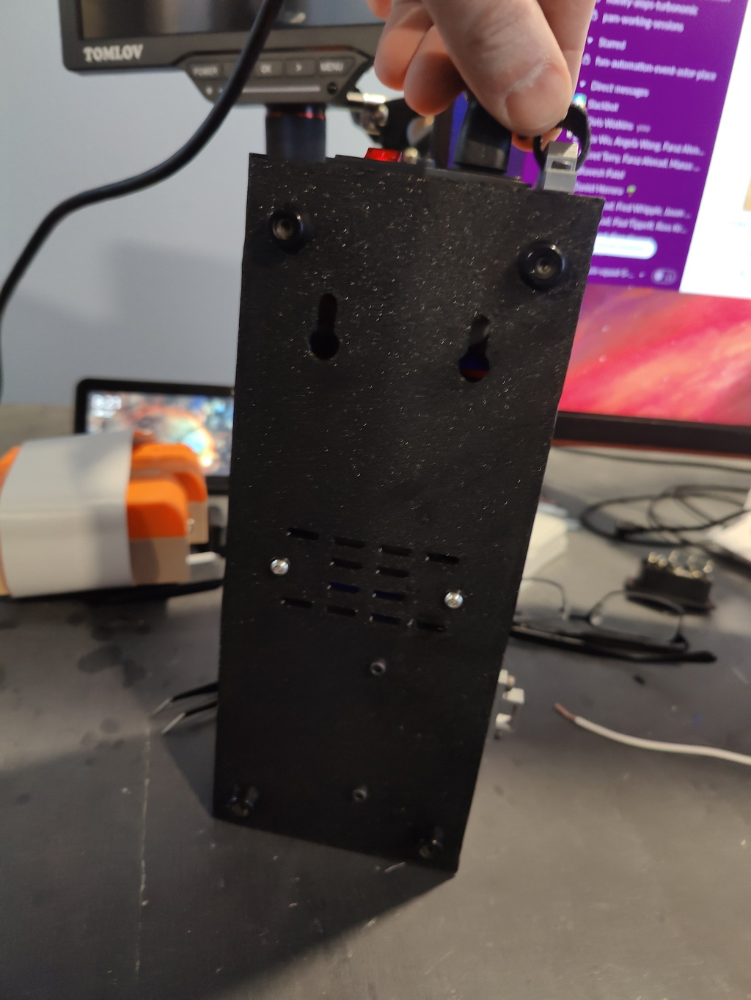
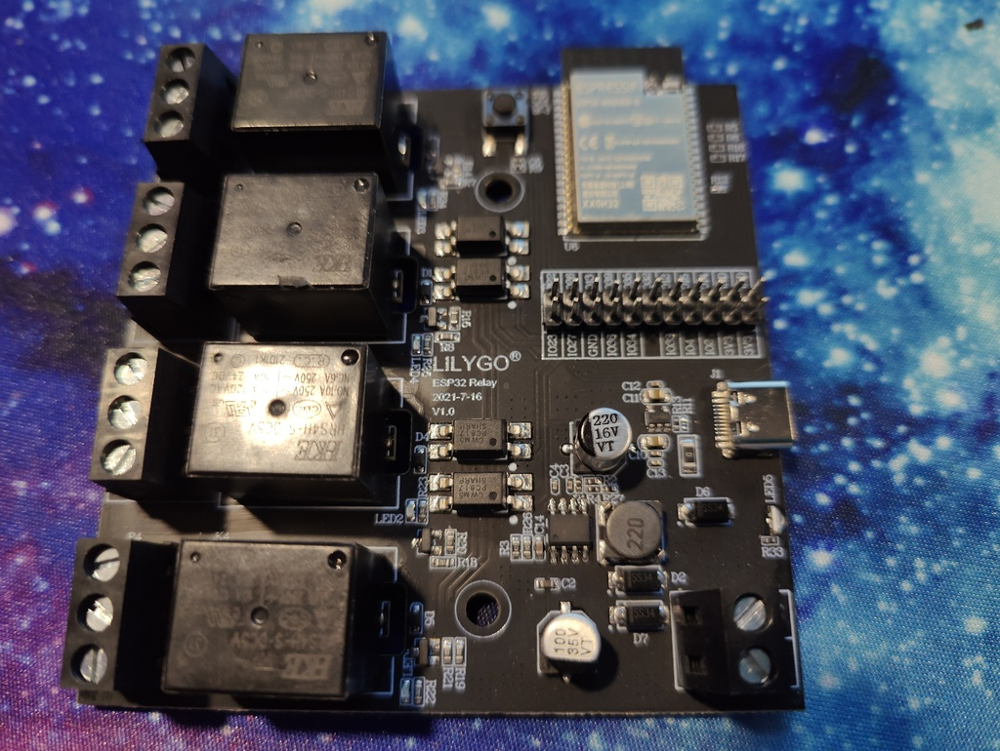

# esp32pdu
- a powerstrip controled by an ESP32 with code. the esp32 has wifi, bluetooth and usb inputs.

# Code
- work in progress. I'll update when something is actionable

## STL

- the stl's are in the STL directory
- original files for editing can be found on [tinkercad](https://www.tinkercad.com/things/9jzXw5aUbPw)

## Images

## Assembly

